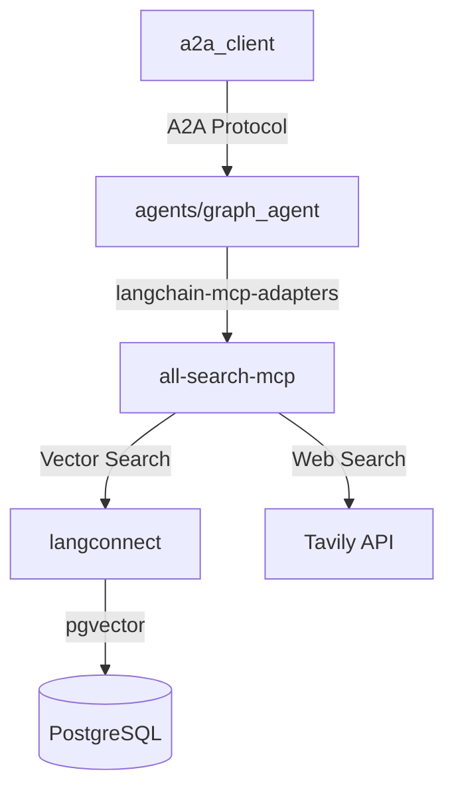

# CLAUDE.md

This file provides guidance to Claude Code (claude.ai/code) when working with code in this repository.

## 프로젝트 개요

TTimes Guide Coding은 웹 검색과 보고서 작성을 자동화하는 LangGraph 기반 멀티 에이전트 시스템입니다. 여러 전문 에이전트들이 A2A(Agent-to-Agent) 프로토콜을 통해 협력하여 고품질의 연구 보고서를 생성합니다.

## 모듈 구조 및 역할

### 📁 /langconnect 

**LangConnect RAG 서비스**

- LangConnect는 FastAPI와 LangChain으로 구축된 RAG(Retrieval-Augmented Generation) 서비스
- PostgreSQL과 pgvector를 활용한 벡터 저장소
- Docker Compose를 통해 pg_vector 데이터베이스와 API 서버를 함께 실행
- 컬렉션과 문서 관리를 위한 REST API 제공
- 벡터 검색 및 문서 처리 기능 지원

### 📁 /all-search-mcp

**통합 MCP 서버**

- FastMCP를 활용한 Model Context Protocol 서버 구현
- 두 가지 주요 API 통합:
  - LangConnect API: 벡터 데이터베이스 검색
  - Tavily Search API: 웹 검색
- 단일 MCP 서버에서 벡터 검색과 웹 검색을 모두 지원
- AI 에이전트가 사용할 통합 검색 도구 제공

### 📁 /agents

**LangGraph 에이전트 개발 모듈**

#### 🔧 /agents/base/

- `BaseAgent`: 모든 LangGraph 에이전트가 상속받아야 하는 기본 클래스
- `BaseState`: 에이전트 상태 관리를 위한 기본 상태 클래스
- 표준화된 에이전트 개발 패턴 제공

#### 🤖 /agents/graph_agent/

- BaseAgent를 상속받은 실제 LangGraph 에이전트 구현체 개발
- 각 에이전트는 특정 도메인이나 작업에 특화
- `langgraph dev` 명령어로 개별 에이전트 동작 테스트
- `langgraph.json` 설정을 통한 서버 실행

#### 🛠️ 도구 통합

- `langchain-mcp-adapters` 라이브러리를 활용하여 all-search-mcp 서버와 연동
- 에이전트는 MCP 서버를 통해 벡터 검색과 웹 검색 기능 활용

### 📁 /a2a_client

**A2A 클라이언트**

- Google ADK(Application Development Kit) 기반 클라이언트 구현
- LangGraph로 개발된 에이전트들을 A2A 서버로 감싸서 개별 서버화
- A2AClient를 통해 분산된 에이전트 서버들과 통신
- Agent2Agent(A2A) 프로토콜을 따르는 에이전트 간 통신 지원

## 시스템 아키텍처



### 포트 할당

- **오케스트레이터**: 8000
- **웹 검색 에이전트**: 8001
- **벡터 검색 에이전트**: 8002
- **계획 에이전트**: 8003
- **보고서 작성 에이전트**: 8004
- **메모리 에이전트**: 8005
- **LangConnect API**: 8080
- **LangGraph Studio**: 8123
- **PostgreSQL**: 5432
- **Redis**: 6379

## 개발 환경 설정

### 필수 요구사항

- Python 3.13 이상
- uv (Python package manager)
- Docker Compose
- LangChain, LangGraph, FastMCP, A2A SDK

### 환경 변수 설정

```bash
# .env.example을 .env로 복사
cp .env.example .env
```

필수 환경 변수:

- `AZURE_OPENAI_API_KEY`: Azure OpenAI API 키
- `AZURE_OPENAI_ENDPOINT`: Azure OpenAI 엔드포인트
- `AZURE_OPENAI_API_VERSION`: API 버전 (기본: 2024-02-15-preview)
- `AZURE_OPENAI_DEPLOYMENT_NAME`: 배포 이름 (기본: gpt-4o-preview)
- `TAVILY_API_KEY`: Tavily Search API 키
- `LANGSMITH_API_KEY`: LangSmith API 키 (선택사항)
- `GOOGLE_API_KEY`: Google API 키 (선택사항)
- 데이터베이스 설정: `POSTGRES_USER`, `POSTGRES_PASSWORD`, `POSTGRES_DB`
- Redis 설정: `REDIS_PASSWORD`

### 의존성 설치

```bash
# 기본 의존성 설치
uv sync

# 개발 의존성 포함 설치
uv sync --dev
```

## 주요 명령어

### 전체 프로젝트 관리

```bash
# 전체 의존성 설치
uv sync --dev

# 코드 품질 관리, 타입 체크
ruff check .
ruff format .
```

### 📁 /langconnect 관련 명령어

```bash
cd langconnect

# Docker 컨테이너 빌드
make build

# 서비스 시작 (백그라운드)
make up

# 개발 모드로 시작 (로그 출력)
make up-dev

# 로그 확인
make logs

# 서비스 재시작
make restart

# 서비스 중지
make down

# 컨테이너 및 볼륨 삭제
make clean

# 코드 포맷팅
make format

# 코드 린팅
make lint

# 테스트 실행
make test

# 특정 테스트 파일만 실행
make test TEST_FILE=tests/unit_tests/test_collections_api.py
```

서비스 접속:

- API 서버: http://localhost:8080
- PostgreSQL: localhost:5432

### 📁 /all-search-mcp 관련 명령어

```bash
# MCP 서버 개발 및 테스트
cd all-search-mcp
# TODO: (FastMCP 서버 실행 명령어들이 여기 추가될 예정)

# MCP 서버 유효성 검사
# mcp validate server.py
```

### 📁 /agents 관련 명령어

```bash
# LangGraph 개발 서버 시작
./scripts/dev_run_langgraph_platform.sh

# LangGraph Studio 접속
# URL: http://localhost:8123

# 새 에이전트 생성 (템플릿 복사)
cp agents/agent/template/base_agent_template.py agents/agent/my_new_agent.py
```

사용 가능한 그래프 (langgraph.json에 정의):

- `planning`: 계획 수립 에이전트
- `memory`: 메모리 관리 에이전트
- `report_writing`: 보고서 작성 에이전트

#### 🚀 빠른 에이전트 개발 시작

1. **템플릿 복사**: `cp agents/agent/template/base_agent_template.py agents/agent/새에이전트.py`
2. **클래스명 변경**: `NewAgentTemplate` → `MyAgent`
3. **노드 추가**: `NODE_NAMES`에 노드 이름 정의
4. **엣지 연결**: `init_edges()`에서 워크플로우 구성
5. **로직 구현**: 각 노드 함수에 비즈니스 로직 추가

> 📖 자세한 내용은 [LangGraph 에이전트 개발 가이드](/docs/langgraph-agent-development-guide.md) 참조

### 📁 /docker 통합 환경

```bash
cd docker

# 전체 시스템 시작 (오케스트레이터 + 모든 에이전트)
docker compose up -d

# 특정 서비스만 시작
docker compose up postgres redis -d

# 로그 확인
docker compose logs -f [service_name]

# 전체 중지
docker compose down

# 볼륨 포함 전체 삭제
docker compose down -v
```

서비스 구성:

- **인프라**: PostgreSQL(pgvector 로 벡터DB 지원), Redis
- **MCP 서버**: tavily-mcp-server, langconnect-mcp-server
- **에이전트**: web-search-agent, vector-search-agent, planning-agent, report-writing-agent, memory-agent
- **오케스트레이터**: 메인 조정자

### 📁 /a2a_client 관련 명령어

```bash
# A2A 클라이언트 실행
cd a2a_client
uv run python research_client.py

# A2A 서버 상태 확인
# TODO: A2A 관련 명령어들이 여기 추가될 예정
```

## 테스트

```bash
# 전체 테스트 실행
pytest

# 특정 디렉토리 테스트
pytest tests/test_agents/

# 커버리지 포함 테스트
pytest --cov=agents tests/

# 비동기 테스트 모드
pytest -m asyncio
```

## 기술 스택

- **LangChain**: AI/LLM 애플리케이션 개발 프레임워크
- **LangGraph**: 상태 기반 AI 에이전트 및 워크플로우 구축
- **FastMCP**: Model Context Protocol 서버 구현용
- **A2A SDK**: AI 에이전트 간 통신 통합 도구
- **LLM 제공자**: Azure OpenAI (gpt-4o-preview)
- **벡터 DB**: PostgreSQL with pgvector, Qdrant
- **캐시**: Redis
- **웹 검색**: Tavily Search API
- **패키지 관리**: uv (Python 3.13+)

## 아키텍처 가이드라인

### 🔗 모듈 간 통신 원칙

1. **계층화된 아키텍처**: 각 모듈은 명확한 책임과 경계를 가짐
2. **표준 프로토콜 사용**: A2A, MCP, REST API 등 표준화된 통신 방식 활용
3. **느슨한 결합**: 모듈 간 직접 의존성 최소화, 인터페이스를 통한 통신

### 🤖 LangGraph 에이전트 개발 시

1. **BaseAgent 상속 필수**: 모든 에이전트는 `agents/base/BaseAgent`를 상속
2. **BaseState 활용**: 상태 관리는 `agents/base/BaseState`를 기반으로 구현
3. **노드 단일 책임**: 각 노드는 하나의 명확한 작업만 수행
4. **타입 안전성**: TypedDict와 타입 힌트를 활용한 상태 관리
5. **에러 핸들링**: 각 노드에서 예외 상황 처리 및 복구 메커니즘 구현
6. **토큰 최적화**: LLM 호출 시 컨텍스트 길이 및 호출 횟수 최적화

> 📚 **상세 가이드**: LangGraph 에이전트 개발에 대한 자세한 내용은 [LangGraph 에이전트 개발 가이드](/docs/langgraph-agent-development-guide.md)를 참조하세요.

### 🔍 MCP 서버 개발 시

1. **FastMCP 활용**: Model Context Protocol 표준 준수
2. **도구 통합**: 벡터 검색(LangConnect)과 웹 검색(Tavily) 통합 제공
3. **에러 처리**: 각 API 호출에 대한 적절한 에러 핸들링
4. **성능 최적화**: 동시 검색 및 결과 캐싱 고려

### 🌐 LangConnect 활용 시

1. **컬렉션 관리**: 도메인별 문서 컬렉션 구성
2. **벡터 임베딩**: 효율적인 문서 벡터화 및 저장
3. **검색 최적화**: 관련성 높은 검색 결과 반환

### 🚀 A2A 서버 개발 시 (LangGraph → A2A 서버)

#### 📋 필수 구성 요소

1. **AgentCard 정의**
   - 에이전트의 메타데이터와 능력을 정의하는 핵심 스키마
   - LangGraph 에이전트의 입출력 형태, 지원 모드, 보안 설정 등을 명시
   - `/v1/card` 엔드포인트에서 제공되는 공개 스펙

2. **Skills 정의**
   - LangGraph 에이전트가 수행할 수 있는 구체적인 작업들
   - 각 스킬별 입출력 스키마, 예제, 태그 설정
   - 스킬 이름, 설명, 지원하는 입출력 모드 명시

3. **입출력 모드(Input/Output Modes)**
   - `text`, `json`, `structured` 등 지원하는 데이터 형식
   - LangGraph State와 호환되는 형태로 정의
   - 기본 입출력 모드 설정

4. **보안 스키마(Security Schemes)**
   - OAuth2, API Key, Bearer Token 등 인증 방식
   - LangGraph 에이전트 접근 권한 관리
   - public/extended AgentCard 구분

#### ⚡ LangGraph → A2A 통합 시 주의사항

1. **상태 변환 관리**

   ```python
   # LangGraph State → A2A Message 변환
   # A2A Task → LangGraph 실행 컨텍스트 변환
   # 상태 직렬화/역직렬화 처리
   ```

2. **비동기 처리**
   - LangGraph의 스트리밍 실행과 A2A의 태스크 관리 연동
   - 중간 결과 전송(`SendMessage`) 및 최종 결과 반환
   - 에러 발생 시 적절한 태스크 상태 업데이트

3. **메모리 및 컨텍스트**
   - LangGraph의 체크포인트와 A2A의 태스크 지속성 연동
   - 대화 히스토리 및 상태 복원 메커니즘
   - 멀티턴 대화 지원을 위한 컨텍스트 관리

4. **도구 통합**
   - LangGraph의 도구들을 A2A 스킬로 매핑
   - MCP 서버(all-search-mcp) 연동 시 프록시 패턴 적용
   - 도구 호출 결과의 직렬화 처리

5. **스키마 호환성**
   - Pydantic 모델과 LangGraph TypedDict 간 변환
   - JSON Schema 검증 및 에러 핸들링
   - 버전 호환성 관리

#### 🔧 구현 패턴

```python
# AgentCard 예시 구조
agent_card = AgentCard(
    name="research_agent",
    description="LangGraph 기반 연구 에이전트",
    url="http://localhost:8080",
    preferred_transport="jsonrpc",
    skills=[
        Skill(
            name="research_task",
            description="주제에 대한 종합적인 연구 수행",
            input_modes=["text", "json"],
            output_modes=["json", "structured"],
            examples=["AI 트렌드 조사", "시장 분석"]
        )
    ],
    default_input_modes=["text"],
    default_output_modes=["json"],
    security_schemes={
        "bearer": {"type": "http", "scheme": "bearer"}
    }
)
```

#### 📊 개발 체크리스트

- [ ] LangGraph 에이전트의 입출력 스키마 정의
- [ ] AgentCard 스펙 작성 및 검증
- [ ] Skills와 LangGraph 노드 매핑
- [ ] 보안 스키마 설정 (필요시)
- [ ] FastAPI 기반 A2A 서버 구현
- [ ] 메시지/태스크 처리 로직 구현
- [ ] 에러 처리 및 복구 메커니즘
- [ ] 스트리밍 응답 처리 (필요시)
- [ ] 테스트 케이스 작성 및 검증 

### 🔗 A2A 클라이언트 개발 시

1. **Google ADK 기반**: 표준 ADK 패턴 및 베스트 프랙티스 준수
2. **비동기 통신**: 에이전트 간 비동기 메시지 처리
3. **에러 복구**: 네트워크 오류 시 재시도 및 폴백 메커니즘

### 📁 코드 구조 원칙

- **모듈별 명확한 책임**: 각 폴더는 특정 기능에 집중
- **의존성 방향**: 상위 모듈(a2a_client)에서 하위 모듈(agents, all-search-mcp)로의 단방향 의존성
- **설정 외부화**: 환경별 설정은 환경 변수 또는 설정 파일로 관리
- **재사용성**: 공통 기능은 base 모듈이나 utils로 추출

## 개발 시 주의사항

1. **환경 변수**: API 키와 같은 민감한 정보는 절대 코드에 하드코딩하지 않음
2. **LLM 호출**: 비용 최적화를 위해 캐싱 전략 고려
3. **테스트**: 개별 노드와 전체 그래프 모두에 대한 테스트 작성
4. **포트 충돌**: 여러 서비스가 동시에 실행되므로 포트 할당에 주의

## 개발 시 라이브러리 관련한 참고 문서가 필요한 경우

1. /docs/{package-name}.txt 문서가 있는지 먼저 참고할 것
2. 만약 문서가 없다면, 웹 검색을 통해 가장 최신 버전의 문서로 개발 방법을 이해할 것

## Using Gemini CLI for Large Codebase Analysis

When analyzing large codebases or multiple files that might exceed context limits, use the Gemini CLI with its massive
context window. Use `gemini -p` to leverage Google Gemini's large context capacity.

### File and Directory Inclusion Syntax

Use the `@` syntax to include files and directories in your Gemini prompts. The paths should be relative to WHERE you run the
gemini command:

#### Examples

**Single file analysis:**

```bash
gemini -p "@src/main.py Explain this file's purpose and structure"
```

**Multiple files:**

```bash
gemini -p "@package.json @src/index.js Analyze the dependencies used in the code"
```

**Entire directory:**

```bash
gemini -p "@src/ Summarize the architecture of this codebase"
```

**Multiple directories:**

```bash
gemini -p "@src/ @tests/ Analyze test coverage for the source code"
```

**Current directory and subdirectories:**

```bash
gemini -p "@./ Give me an overview of this entire project"

# Or use --all_files flag:
gemini --all_files -p "Analyze the project structure and dependencies"
```

**Implementation Verification Examples:**

Check if a feature is implemented:

```bash
gemini -p "@src/ @lib/ Has dark mode been implemented in this codebase? Show me the relevant files and functions"
```

Verify authentication implementation:

```bash
gemini -p "@src/ @middleware/ Is JWT authentication implemented? List all auth-related endpoints and middleware"
```

Check for specific patterns:

```bash
gemini -p "@src/ Are there any React hooks that handle WebSocket connections? List them with file paths"
```

Verify error handling:

```bash
gemini -p "@src/ @api/ Is proper error handling implemented for all API endpoints? Show examples of try-catch blocks"
```

Check for rate limiting:

```bash
gemini -p "@backend/ @middleware/ Is rate limiting implemented for the API? Show the implementation details"
```

Verify caching strategy:

```bash
gemini -p "@src/ @lib/ @services/ Is Redis caching implemented? List all cache-related functions and their usage"
```

Check for specific security measures:

```bash
gemini -p "@src/ @api/ Are SQL injection protections implemented? Show how user inputs are sanitized"
```

Verify test coverage for features:

```bash
gemini -p "@src/payment/ @tests/ Is the payment processing module fully tested? List all test cases"
```

### When to Use Gemini CLI

Use gemini -p when:

- Analyzing entire codebases or large directories
- Comparing multiple large files
- Need to understand project-wide patterns or architecture
- Current context window is insufficient for the task
- Working with files totaling more than 100KB
- Verifying if specific features, patterns, or security measures are implemented
- Checking for the presence of certain coding patterns across the entire codebase

### Important Notes

- Paths in @ syntax are relative to your current working directory when invoking gemini
- The CLI will include file contents directly in the context
- No need for --yolo flag for read-only analysis
- Gemini's context window can handle entire codebases that would overflow Claude's context
- When checking implementations, be specific about what you're looking for to get accurate results